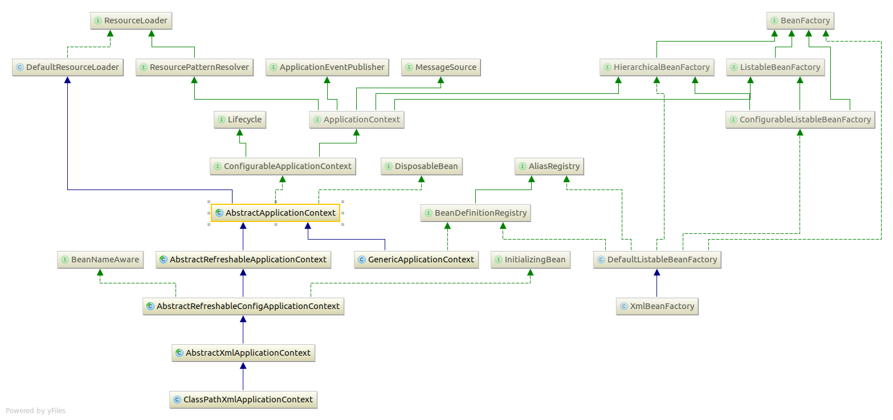

# Spring Framework

## IOC容器

#### 接口

1. BeanFactory获取bean实例
2. BeanDefinitionRegistry定义bean,实现此接口的类可以增删改查Bean的定义
3. BeanDefinition代表一个bean的定义
4. BeanDefinitionBuilder工具类，用于实例化BeanDefinition
5. ListableBeanFactory可以查询bean可以认为是BeanDefinitionRegistry的扩充
6. ApplicationContext只有一些getXX方法
7. ConfigurableApplicationContext相比ApplicationContext增加了可配置的功能

**注：bean的访问和定义是通过两个接口来描述的，**BeanFactory只定义访问bean实例的方法，BeanDefinitionRegistry描述bean的定义。**BeanFactory根据BeanDefinitionRegistry的描述来构建bean实例。**通常BeanFactory的实现都会实现**BeanDefinitionRegistry**

#### 抽象类

1. AbstractApplicationContext核心类，spring的初始化逻辑都在这里面，查看这个类可以明白spring的各个功能怎么使用。
2. AbstractRefreshableApplicationContext，支持多次调用refresh方法
3. 

## Spring xml定义解析

#### 接口

1. NamespaceHandler处理各个名字空间,如context,aop,tx等等
## spring mvc
1. HttpServletBean
2. FrameworkServlet
3. DispatcherServlet

DispatcherServlet继承FrameworkServlet继承HttpServletBean，web.xml中的的DispatcherServlet参数名与类中的属性名对应，
如contextConfigLocation对应FrameworkServlet中的contextConfigLocation，HttpServletBean中的init方法负责将web.xml中的
参数值set到类的属性中去，接着调用子类FrameworkServlet实现的initServletBean方法，这个方法负责创建和配置webApplicationContext实例
接着调用DispatcherServlet#onRefresh方法
## Transaction

#### 接口

1. PlatformTransactionManager核心接口，用于抽象事务操作，目前有3中实现：DataSourceTransactionManager对应与普通的jdbc，JtaTransactionManager对应jta事务管理，HibernateTransactionManager对应hinernate 的事务管理
2. TransactionDefinition定义一个事务，包括事务的传播，超时，然后使用PlatformTransactionManager创建
3. TransactionStatus代表一个事务。

#### 开发模式

1. xml配置或注解的方式

   内部实现是依赖spring的aop，将事物管理横切进目标bean。可以使用注解Transactional来定义事务（隔离，传播，回滚规则）

2. 编程的方式操作事务
   1. 使用TransactionTemplate
   2. 直接使用PlatformTransactionManager

### 任务执行和调度

#### 接口

1. TaskExecutor

   继承java的Executor接口，所以用法和java的Executor一样

2. TaskScheduler定义了调度方法。 1. Trigger：触发器，可以定义task执行的条件，由TaskScheduler使用，可以实现crond功能 2. TriggerContext:保存Trigger的上下文信息

   **实现**

   [实现类](http://docs.spring.io/spring/docs/3.2.18.RELEASE/spring-framework-reference/htmlsingle/#scheduling)

### Spring MVC

#### RequestMappingHandlerMapping
1. 通过注解RequestMapping创建RequestMappingInfo，RequestMappingHandlerMapping#createRequestMappingInfo

### ORM

#### JPA
使用

