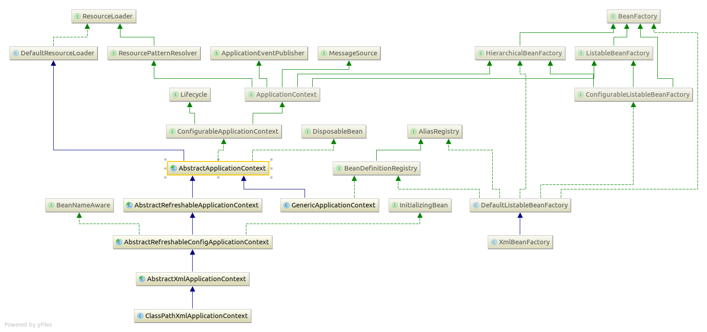

# Spring Framework

## IOC容器

#### 接口

1. BeanFactory获取bean实例
2. BeanDefinitionRegistry定义bean,实现此接口的类可以增删改查Bean的定义
3. BeanDefinition代表一个bean的定义
4. BeanDefinitionBuilder工具类，用于实例化BeanDefinition
5. ListableBeanFactory可以查询bean可以认为是BeanDefinitionRegistry的扩充
6. ApplicationContext只有一些getXX方法
7. ConfigurableApplicationContext相比ApplicationContext增加了可配置的功能

**注：bean的访问和定义是通过两个接口来描述的，**BeanFactory只定义访问bean实例的方法，BeanDefinitionRegistry描述bean的定义。**BeanFactory根据BeanDefinitionRegistry的描述来构建bean实例。**通常BeanFactory的实现都会实现**BeanDefinitionRegistry**

#### 工具类

1. ClassPathScanningCandidateComponentProvide查找包下面的指定的类

#### 抽象类

1. ***AbstractApplicationContext核心类，spring的初始化逻辑都在这里面，查看这个类可以明白spring的各个功能怎么使用。***
2. AbstractRefreshableApplicationContext，支持多次调用refresh方法
4. 

## Spring xml定义解析

#### 接口

1. NamespaceHandler处理各个名字空间,如context,aop,tx等等
## spring mvc
1. HttpServletBean
2. FrameworkServlet
3. DispatcherServlet

DispatcherServlet继承FrameworkServlet继承HttpServletBean，web.xml中的的DispatcherServlet参数名与类中的属性名对应，
如contextConfigLocation对应FrameworkServlet中的contextConfigLocation，HttpServletBean中的init方法负责将web.xml中的
参数值set到类的属性中去，接着调用子类FrameworkServlet实现的initServletBean方法，这个方法负责创建和配置webApplicationContext实例
接着调用DispatcherServlet#onRefresh方法


## 扩展Spring

### BeanFactoryPostProcessor
实现类：PropertySourcesPlaceholderConfigurer，

### BeanPostProcessor 

## Transaction

#### 接口

1. PlatformTransactionManager核心接口，用于抽象事务操作，目前有3中实现：DataSourceTransactionManager对应与普通的jdbc，JtaTransactionManager对应jta事务管理，HibernateTransactionManager对应hinernate 的事务管理
2. TransactionDefinition定义一个事务，包括事务的传播，超时，然后使用PlatformTransactionManager创建
3. TransactionStatus代表一个事务。

#### 开发模式

1. xml配置或注解的方式

   内部实现是依赖spring的aop，将事物管理横切进目标bean。可以使用注解Transactional来定义事务（隔离，传播，回滚规则）

2. 编程的方式操作事务
   1. 使用TransactionTemplate
   2. 直接使用PlatformTransactionManager

### 任务执行和调度

#### 接口

1. TaskExecutor

   继承java的Executor接口，所以用法和java的Executor一样

2. TaskScheduler定义了调度方法。 1. Trigger：触发器，可以定义task执行的条件，由TaskScheduler使用，可以实现crond功能 2. TriggerContext:保存Trigger的上下文信息

   **实现**

   [实现类](http://docs.spring.io/spring/docs/3.2.18.RELEASE/spring-framework-reference/htmlsingle/#scheduling)


### Spring MVC

#### DispatcherServlet初始化时序图

```plantuml
participant ServletContainer
activate ServletContainer

create DispatcherServlet
ServletContainer -> DispatcherServlet : new
activate DispatcherServlet

    ServletContainer -> DispatcherServlet : HttpServletBean#init()

    create BeanWrapper
    DispatcherServlet-> BeanWrapper : new
    activate BeanWrapper
    note right
        学习BeanWrapper的用法
    end note
    DispatcherServlet-> BeanWrapper : setPropertyValues
    BeanWrapper -> DispatcherServlet: setXXX
    deactivate BeanWrapper

    DispatcherServlet -> DispatcherServlet : FrameworkServlet#initServletBean()
    activate DispatcherServlet
        DispatcherServlet -> DispatcherServlet : FrameworkServlet#initWebApplicationContext
        activate DispatcherServlet
            create WebApplicationContext
            DispatcherServlet -> WebApplicationContext: createWebApplicationContext
            activate WebApplicationContext
            note left
                创建webApplicationContext层级，并且刷新
            end note

            DispatcherServlet -> DispatcherServlet : onRefresh
            activate DispatcherServlet
                DispatcherServlet -> DispatcherServlet : initStrategies
                activate DispatcherServlet
                    DispatcherServlet -> DispatcherServlet : initMultipartResolver
                    DispatcherServlet -> DispatcherServlet : initLocaleResolver
                    DispatcherServlet -> DispatcherServlet : initThemeResolver
                    DispatcherServlet -> DispatcherServlet : initHandlerMappings
                    DispatcherServlet -> DispatcherServlet : initHandlerAdapters
                    DispatcherServlet -> DispatcherServlet : initHandlerExceptionResolvers
                    DispatcherServlet -> DispatcherServlet : initRequestToViewNameTranslator
                    DispatcherServlet -> DispatcherServlet : initViewResolvers
                    DispatcherServlet -> DispatcherServlet : initFlashMapManager
                deactivate DispatcherServlet
                DispatcherServlet -> DispatcherServlet : FrameworkServlet#initFrameworkServlet
            deactivate DispatcherServlet
        deactivate DispatcherServlet
    deactivate DispatcherServlet
```

#### DispatcherServlet#initHandlerMappings 流程图

```plantuml

(*) --> 开始
if "detectAllHandlerMappings" then
    -->[true] "搜索ApplicationContext中HandlerMapping的实现类,添加到handlerMappings中"
    -->  " "
else
    -->[false] "添加HANDLER_MAPPING_BEAN_NAME名字的bean到handlerMappings中"
    -->  " "

endif

if "handlerMappings==null" then
    -->[true] "读取DispatcherServlet.properties中配置的默认实现类"
    note left
        DispatcherServlet.properties中配置两个默认实现，
        BeanNameUrlHandlerMapping和RequestMappingHandlerMapping
    end note
endif

--> (*)
```

#### RequestMappingHandlerMapping初始化时序图

```plantuml

participant WebApplicationContext
activate WebApplicationContext

participant RequestMappingHandlerMapping
activate RequestMappingHandlerMapping

WebApplicationContext -> RequestMappingHandlerMapping: ApplicationObjectSupport#setApplicationContext
activate RequestMappingHandlerMapping
RequestMappingHandlerMapping -> RequestMappingHandlerMapping: AbstractHandlerMapping#initApplicationContext
activate RequestMappingHandlerMapping
RequestMappingHandlerMapping -> RequestMappingHandlerMapping: AbstractHandlerMapping#extendInterceptors
RequestMappingHandlerMapping -> RequestMappingHandlerMapping: AbstractHandlerMapping#detectMappedInterceptors
RequestMappingHandlerMapping -> RequestMappingHandlerMapping: AbstractHandlerMapping#initInterceptors
deactivate RequestMappingHandlerMapping
deactivate RequestMappingHandlerMapping

RequestMappingHandlerMapping -> RequestMappingHandlerMapping: RequestMappingHandlerMapping#afterPropertiesSet
activate RequestMappingHandlerMapping

create RequestMappingInfo.BuilderConfiguration
RequestMappingHandlerMapping -> RequestMappingInfo.BuilderConfiguration: new
activate  RequestMappingInfo.BuilderConfiguration

RequestMappingHandlerMapping -> RequestMappingInfo.BuilderConfiguration: setUrlPathHelper
RequestMappingHandlerMapping -> RequestMappingInfo.BuilderConfiguration: setPathMatcher
RequestMappingHandlerMapping -> RequestMappingInfo.BuilderConfiguration: setSuffixPatternMatch
RequestMappingHandlerMapping -> RequestMappingInfo.BuilderConfiguration: setTrailingSlashMatch
RequestMappingHandlerMapping -> RequestMappingInfo.BuilderConfiguration: setRegisteredSuffixPatternMatch
RequestMappingHandlerMapping -> RequestMappingInfo.BuilderConfiguration: setContentNegotiationManager

RequestMappingHandlerMapping -> RequestMappingHandlerMapping: AbstractHandlerMethodMapping#afterPropertiesSet
activate RequestMappingHandlerMapping
RequestMappingHandlerMapping -> RequestMappingHandlerMapping: AbstractHandlerMethodMapping#initHandlerMethods
note left
扫描applicationContext或祖先Context中的实体，
end note
deactivate RequestMappingHandlerMapping

deactivate RequestMappingHandlerMapping
```

#### DispatcherServlet#initHandlerAdapters

与initHandlerMappings的过程类似，默认的HandlerAdapter是  
HttpRequestHandlerAdapter  
SimpleControllerHandlerAdapter  
RequestMappingHandlerAdapter  

#### RequestMappingHandlerAdapter初始化

```plantuml
participant WebApplicationContext
activate WebApplicationContext

participant RequestMappingHandlerAdapter
activate RequestMappingHandlerAdapter
[-> RequestMappingHandlerAdapter: 构造函数
WebApplicationContext -> RequestMappingHandlerAdapter: afterPropertiesSet

```

afterPropertiesSet方法流程图

```plantuml

(*) --> initControllerAdviceCache()

if "this.argumentResolvers == null" then
    --> [true] resolvers = getDefaultArgumentResolvers();
    --> argumentResolvers = new HandlerMethodArgumentResolverComposite().addResolvers(resolvers);
    --> " "
else
    --> [false] " "
endif

if "this.initBinderArgumentResolvers == null" then
    --> [true] resolvers = getDefaultInitBinderArgumentResolvers();
    --> initBinderArgumentResolvers = new HandlerMethodArgumentResolverComposite().addResolvers(resolvers);
    --> "  "
else 
    --> [false] "  "
endif

if "this.returnValueHandlers == null" then
    --> [true] handlers = getDefaultReturnValueHandlers();
    --> returnValueHandlers = new HandlerMethodReturnValueHandlerComposite().addHandlers(handlers);
    --> "   "
else
    --> [false] "   "
endif

--> (*)
```

#### DispatcherServlet处理http get请求

```plantuml

participant DispatcherServlet
activate DispatcherServlet

participant HttpServletRequest
activate HttpServletRequest

participant WebApplicationContext
activate WebApplicationContext

participant HandlerExecutionChain
activate HandlerExecutionChain

participant HandlerAdapter
activate HandlerAdapter

[-> DispatcherServlet: doService
activate DispatcherServlet
    DispatcherServlet -> HttpServletRequest: setAttribute(WEB_APPLICATION_CONTEXT_ATTRIBUTE, applicationContext)
    DispatcherServlet -> HttpServletRequest: setAttribute 设置其他属性值
    DispatcherServlet -> DispatcherServlet: doDispatch
    activate DispatcherServlet
        DispatcherServlet -> DispatcherServlet: checkMultipart
        note left
            调用MultipartResolver，并返回MultipartHttpServletRequest
        end note

        DispatcherServlet -> DispatcherServlet: getHandler

        DispatcherServlet -> DispatcherServlet: getHandlerAdapter

        DispatcherServlet -> HandlerExecutionChain: applyPreHandle
        HandlerExecutionChain --> DispatcherServlet: true | false

        DispatcherServlet -> HandlerAdapter: handle
        HandlerAdapter --> DispatcherServlet: ModelAndView mv

        DispatcherServlet -> DispatcherServlet: applyDefaultViewName
        DispatcherServlet -> HandlerExecutionChain: applyPostHandle
        DispatcherServlet -> DispatcherServlet: processDispatchResult
    deactivate DispatcherServlet
deactivate DispatcherServlet


```

#### DispatcherServlet#getHandler流程

循环调用handlerMappings中的HandlerMapping#getHandler()方法，直到有HandlerMapping返回非空  
对象退出循环，返回HandlerMapping#getHandler()返回的HandlerExecutionChain对象

#### RequestMappingHandlerMapping类图

```plantuml

AbstractHandlerMapping <|-- AbstractHandlerMethodMapping
AbstractHandlerMethodMapping <|-- RequestMappingInfoHandlerMapping
RequestMappingInfoHandlerMapping <|-- RequestMappingHandlerMapping

abstract class AbstractHandlerMapping {
    +getHandler()
    {abstract} #getHandlerInternal()
}
```

#### AbstractHandlerMapping#getHandler流程

```plantuml

(*) --> handler = getHandlerInternal(request)

if "handler==null" then
    --> [true] "handler = getDefaultHandler()"
    if "handler==null" then
        --> [true] (*)
    else
        --> [false] " "
    endif
else
    --> [false] " "
    if "handler instanceof String" then
    note left
        如果是字符串就认为是bean name，需要从applicationContext从取出
    end note
        -->[true] handlerName = (String) handler;
        --> handler = obtainApplicationContext().getBean(handlerName);
        --> "  "
    else
        --> [false] "  "
    endif

    --> executionChain = getHandlerExecutionChain(handler, request);
    --> return executionChain

endif

--> (*)
```

#### ModelAndView

包含Object view ，ModelMap model， HttpStatus status三个字段。其中ModelMap直接集成LinkedHashMap保存键值对

#### RequestMappingHandlerMapping

1. 通过注解RequestMapping创建RequestMappingInfo，RequestMappingHandlerMapping#createRequestMappingInfo

### ORM

#### JPA

使用