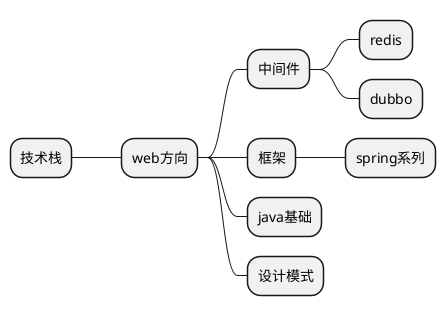

# 面试

## java集合

1. ArrayList基于数组，add的时候数组长度不够的时候会通过System.arraycopy扩张,remove的时候会收缩同样使用System.arraycopy来移动元素。
2. LinkedList基于链表

## 多线程

1. java内存模型，happen-before规则。

## 设计模式

### 单例模式

1. 主要注意线程安全的问题
2. [最佳实践](https://gist.github.com/imlinux/22dbefb508f790d5e84575a2e62ae08a)


### 面试题

1. String类为什么是final的
为了提升性能String被设计为是常量, 使用final的目的是防止子类修改String的语义

2. 常量池

```
public class Apple {
    public static void main(String[] args) {
        String a = "abc";
        String b = "abc";
        String c = new String("abc");
        System.out.println(a==b);
        System.out.println(a.equals(b));
        System.out.println(a==c);
        System.out.println(a.equals(c));
    }
}

答案是：true、true、false、true
``` 

3. HashMap的源码, 实现原理, 底层结构


## 技术栈




